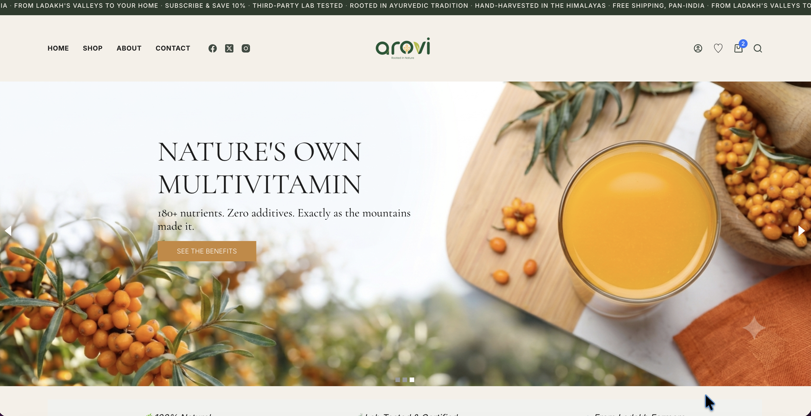
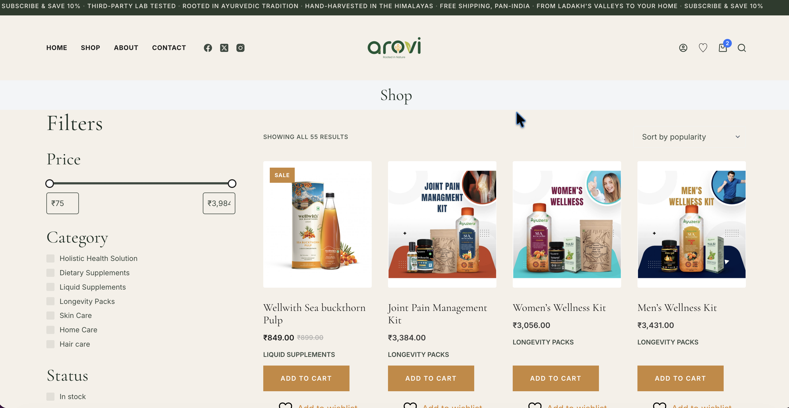
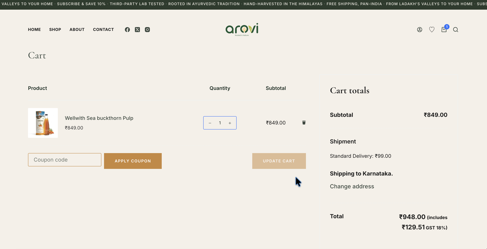

# Arovi Life — WooCommerce Storefront

**Live site:** [arovi.life](https://arovi.life)

A production WooCommerce store for **Arovi Life**, an authorised reseller of
WellWith India Pvt. Ltd.'s Sea Buckthorn wellness range — supplements,
skincare, and haircare sourced from Ladakh at 3,500m altitude. This repo
contains the custom theme code, plugin configuration, and infrastructure
setup for the storefront.

---

## What I built

This was an end-to-end redesign and hardening of an existing WooCommerce
store — covering front-end, e-commerce flow, and production infrastructure.

**Storefront & UX**
- Custom-styled theme built on Blocksy, with a defined design system
  (typography: Cormorant Garamond / Inter, custom color tokens)
- Redesigned Homepage, Shop, Single Product, Cart, and Checkout flows
- Custom footer, login/signup modal, search, and contact form
- Blog / content section with SEO-oriented long-form articles
- Product organization by wellness concern (Immunity, Skin & Hair, Energy,
  Digestion, Women's/Men's Wellness)

**E-commerce**
- WooCommerce checkout customization
- Razorpay payment gateway integration (UPI, cards, netbanking, wallets)
- Transactional email setup (order confirmations, contact form) via SMTP

**Infrastructure & Security**
- Migrated DNS to **Cloudflare** (CDN, WAF, proxying) with zero email downtime
- Configured **SPF, DKIM, DMARC** across two mail providers (Hostinger +
  Brevo) for deliverability and anti-spoofing
- `.htaccess` hardening — directory listing disabled, `wp-config.php` and
  `xmlrpc.php` access blocked
- HTTP security headers (targeting an A grade on securityheaders.com)
- **Wordfence** firewall, WAF, malware scanning, and 2FA
- Automated weekly backups via **UpdraftPlus**
- Uptime monitoring on homepage + checkout via **UptimeRobot**
- **GitHub Actions** CI/CD pipeline — auto-deploys `wp-content` to the
  production server via FTP on push to `main`

**Read the process, not just the checklist:**
- [DNS migration to Cloudflare](docs/dns-migration-cloudflare.md) — zero-downtime, zero email disruption
- [Security hardening](docs/security-hardening.md) — the full approach and why

---

## Tech stack

> Note: WordPress core files are intentionally excluded — this repo tracks
> the custom code (`wp-content`) rather than the full CMS install.

---

## Screenshots

| Homepage | Shop | Checkout |
|---|---|---|
|  |  |  |

**Mobile view:**

---

## About

Arovi is an authorised reseller of [WellWith India Pvt. Ltd.](https://arovi.life)
products. This project was built and maintained end-to-end — design,
development, e-commerce configuration, DNS/email infrastructure, and
security hardening.
